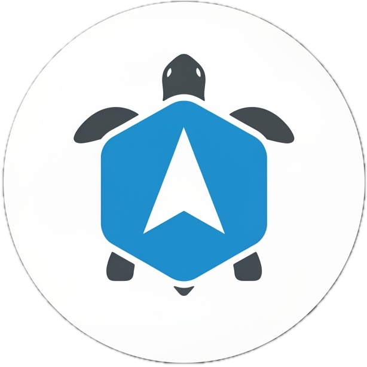

# Pose Nudge
<p align="center">
  <!-- 프로젝트 로고를 여기에 추가할 수 있습니다. -->
  
  <br>
  <strong>AI-Powered Posture Correction Assistant - Real-time Posture Analysis and Improvement Guide</strong>
</p>

<p align="center">
  <!-- 소셜 및 커뮤니티 배지 -->
  <a href="https://github.com/dduldduck/pose-nudge/stargazers"></a>
  <a href="https://github.com/dduldduck/pose-nudge/network/members"></a>
  <a href="https://github.com/dduldduck/pose-nudge/graphs/contributors"></a>
  <br>
  <!-- 상태 및 릴리즈 배지 -->
  <a href="https://github.com/dduldduck/pose-nudge/releases"></a>
  <a href="https://github.com/dduldduck/pose-nudge/releases"></a>
  <a href="LICENSE"></a>
  <br>
  <!-- 개발 활동 배지 -->
  <a href="https://github.com/dduldduck/pose-nudge/actions/workflows/release.yml"></a>
  <a href="https://github.com/dduldduck/pose-nudge/issues"></a>
  <a href="https://github.com/dduldduck/pose-nudge/pulls"></a>
</p>

<p align="center">
  <a href="./README.md"></a>
  <a href="./README.ko.md"></a>
</p>

---

## ✨ Key Features

Pose Nudge is a powerful desktop application that uses your webcam to analyze posture in real-time and sends notifications when posture issues like forward head posture are detected, helping you maintain proper posture.

*   **📹 Real-time Posture Analysis**: Webcam-based real-time posture monitoring and AI-powered analysis
*   **🦴 Forward Head Posture Detection**: Calculates neck and shoulder line angles to detect forward head posture
*   **🔔 Smart Notifications**: Browser notifications and improvement recommendations when posture issues are detected
*   **📊 Posture Score**: Displays current posture status scored from 0-100 points
*   **📈 Statistics Dashboard**: View posture improvement progress and session records
*   **⚙️ Personalized Settings**: Customizable notification intervals, sensitivity, and analysis frequency

---

## 🎥 Demo

### Screenshots

<!-- Add screenshots here -->
<p align="center">
  
  
</p>

### Demo GIF

<!-- Add demo GIF here -->
<p align="center">
  
</p>

---

## 📥 Download

Download the latest version of Pose Nudge for your operating system.

| Operating System | File Format | Download Link |
| :---: | :---: | :---: |
| 💻 **Windows** | `.exe` | <a href="https://github.com/dduldduck/pose-nudge/releases/latest"></a> |
| 🍏 **macOS** | `.dmg` | <a href="https://github.com/dduldduck/pose-nudge/releases/latest"></a> |
| 🐧 **Linux** | `.AppImage` | <a href="https://github.com/dduldduck/pose-nudge/releases/latest"></a> |

---

## 👨‍💻 For Developers

If you're interested in contributing, follow this guide to set up the project locally.

### Prerequisites

- [Node.js](https://nodejs.org/) (v18 or higher)
- [Rust](https://www.rust-lang.org/) (v1.70.0 or higher)
- [Git](https://git-scm.com/)

### Installation & Run

```bash
# 1. Clone the project
git clone https://github.com/dduldduck/pose-nudge.git
cd pose-nudge

# 2. Install Node.js dependencies
npm install

# 3. Run in development mode
npm run tauri dev
```

### Project Structure
```
pose-nudge/
├── src/                    # React Frontend
│   ├── components/         # UI Components
│   │   ├── ui/            # shadcn/ui Components
│   │   ├── Dashboard.tsx   # Dashboard
│   │   ├── WebcamCapture.tsx # Webcam Component
│   │   └── SettingsPage.tsx # Settings Page
│   ├── lib/               # Utility Functions
│   ├── locales/           # Internationalization Support
│   └── App.tsx            # Main App Component
├── src-tauri/             # Rust Backend
│   ├── src/
│   │   ├── main.rs        # Main Backend Logic
│   │   ├── pose_analysis.rs # Posture Analysis Engine
│   │   └── notifications.rs # Notification System
│   ├── Cargo.toml         # Rust Dependencies
│   └── tauri.conf.json    # Tauri Configuration
├── models/                # AI Model Files
├── public/                # Static Files
└── locales/               # Localization Files
```

---

## 🛠️ Tech Stack

-   **Framework**: Tauri (Rust + React)
-   **Frontend**: React 19, TypeScript, Tailwind CSS 4
-   **Backend**: Rust, Tauri 2
-   **AI/ML**: YOLO-Pose Model (planned for future integration)
-   **Build/Deployment**: Tauri CLI

---

## 🤝 Contributing

Contributions are always welcome! Whether it's bug reports, feature suggestions, or code contributions, we welcome all forms of participation. Please check out our [Contributing Guidelines](CONTRIBUTING.md) for more details.

---

## ✨ Contributors

Thanks to these wonderful people who have made this project better! ([emoji key](https://allcontributors.org/docs/en/emoji-key))

<!-- ALL-CONTRIBUTORS-LIST:START - Do not remove or modify this section -->
<!-- prettier-ignore-start -->
<!-- markdownlint-disable -->
<table>
  <tbody>
    <tr>
      <td align="center" valign="top" width="14.28%"><a href="https://github.com/DDULDDUCK"><br /><sub><b>Jaeseok Song</b></sub></a><br /><a href="https://github.com/dduldduk/pose-nodge/commits?author=DDULDDUCK" title="Code">💻</a> <a href="#maintenance-DDULDDUCK" title="Maintenance">🚧</a></td>
    </tr>
  </tbody>
  <tfoot>
    <tr>
      <td align="center" size="13px" colspan="7">
        
          <a href="https://all-contributors.js.org/docs/en/bot/usage">Add your contributions</a>
        </img>
      </td>
    </tr>
  </tfoot>
</table>

<!-- markdownlint-restore -->
<!-- prettier-ignore-end -->

<!-- ALL-CONTRIBUTORS-LIST:END -->

---

## 📜 License

This project is licensed under the [AGPLv3 License](LICENSE).

## Contributors ✨

Thanks goes to these wonderful people ([emoji key](https://allcontributors.org/docs/en/emoji-key)):

<!-- ALL-CONTRIBUTORS-LIST:START - Do not remove or modify this section -->
<!-- prettier-ignore-start -->
<!-- markdownlint-disable -->
<!-- markdownlint-restore -->
<!-- prettier-ignore-end -->
<!-- ALL-CONTRIBUTORS-LIST:END -->

This project follows the [all-contributors](https://github.com/all-contributors/all-contributors) specification. Contributions of any kind welcome!
